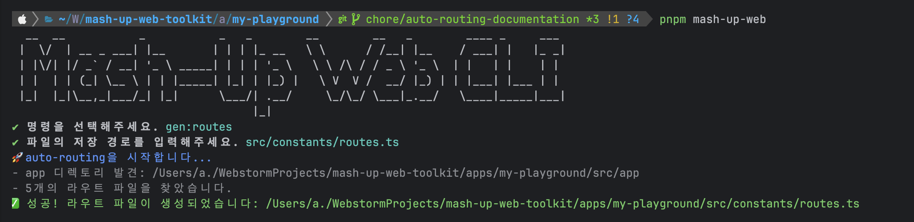

# Usage

`app` 디렉토리 구조를 분석하여 타입 안전한 `ROUTES` 상수를 자동으로 생성합니다.

## 🚀 라우트 상수 생성

### 1. CLI 실행

import Tabs from '@theme/Tabs';
import TabItem from '@theme/TabItem';

<Tabs groupId="package-managers">
  <TabItem value="pnpm" label="pnpm" default>

```bash
pnpm mash-up-web
```

  </TabItem>
  <TabItem value="npm" label="npm">

```bash
npx mash-up-web
```

  </TabItem>
  <TabItem value="yarn" label="yarn">

**방법 1: npx 사용 (권장)**

```bash
npx mash-up-web
```

**방법 2: package.json 스크립트 추가**

```json
{
  "scripts": {
    "mash-up-web": "mash-up-web",
    "gen:routes": "mash-up-web gen:routes"
  }
}
```

```bash
yarn mash-up-web
```

  </TabItem>
</Tabs>

### 2. `gen:routes` 선택

CLI를 실행하면 다음과 같은 메뉴가 나타납니다:

```
? 명령을 선택해주세요. (Use arrow keys)
  gen:config
  gen:api-config
  gen:api
❯ gen:routes
```

**`gen:routes`** 를 선택하세요.


### 3. 출력 경로 입력

저장할 파일 경로를 입력합니다. 기본값은 `src/constants/routes.ts` 입니다.

```
? 파일의 저장 경로를 입력해주세요. (src/constants/routes.ts)
```

## 🖥️ 실행 시 화면




## 📁 생성되는 파일 구조

다음과 같은 `app` 디렉토리 구조가 있다고 가정합니다:

```
src/app/
├── page.tsx                      # /
├── landing/
│   └── page.tsx                  # /landing
├── profile/
│   └── page.tsx                  # /profile
├── blog/
│   └── [slug]/
│       └── page.tsx              # /blog/[slug]
├── dashboard/
│   └── settings/
│       └── page.tsx              # /dashboard/settings
├── (auth)/                       # Route Group → URL 경로 제외
│   └── login/
│       └── page.tsx              # /login
└── _components/                  # Private Folder → 라우트 제외
    └── Button.tsx
```

### 생성 결과

```ts title="src/constants/routes.ts"
export const ROUTES = {
  BLOG: {
    _SLUG: '/blog/[slug]'
  },
  DASHBOARD: {
    SETTINGS: '/dashboard/settings'
  },
  LANDING: '/landing',
  LOGIN: '/login',
  PROFILE: '/profile',
  ROOT: '/'
} as const;
```

## 🎯 활용 예시

생성된 `ROUTES` 상수를 활용하면 라우트 경로를 타입 안전하게 사용할 수 있습니다:

```tsx
import { ROUTES } from '@/constants/routes';
import Link from 'next/link';

// ✅ 타입 안전한 라우트 사용
<Link href={ROUTES.DASHBOARD.SETTINGS}>설정</Link>
<Link href={ROUTES.BLOG._SLUG}>블로그</Link>

// ✅ router.push와 함께 사용
import { useRouter } from 'next/navigation';

const router = useRouter();
router.push(ROUTES.PROFILE);
```

:::tip 라우트 변경 시

페이지를 추가하거나 삭제할 때마다 `gen:routes`를 다시 실행하면 `ROUTES` 상수가 최신 상태로 업데이트됩니다.

:::
