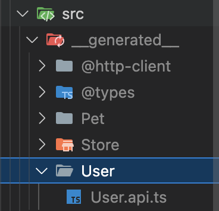
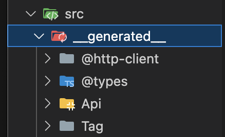

# Usage

설정 파일(`mashup.config.ts`)이 준비되었다면 OpenAPI 스펙에서 TypeScript API 클라이언트 코드를 생성할 수 있습니다.

## 🚀 API 코드 생성

### 1. CLI 실행

import Tabs from '@theme/Tabs';
import TabItem from '@theme/TabItem';

<Tabs groupId="package-managers">
  <TabItem value="pnpm" label="pnpm" default>

```bash
pnpm mash-up-web
```

  </TabItem>
  <TabItem value="npm" label="npm">

```bash
npx mash-up-web
```

  </TabItem>
  <TabItem value="yarn" label="yarn">

**방법 1: npx 사용 (권장)**

```bash
npx mash-up-web
```

**방법 2: package.json 스크립트 추가**

```json
{
  "scripts": {
    "mash-up-web": "mash-up-web",
    "gen:api": "mash-up-web gen:api"
  }
}
```

```bash
yarn mash-up-web
```

  </TabItem>
</Tabs>

### 2. API 자동생성

CLI를 실행하면 다음과 같은 메뉴가 나타납니다:

```
? 명령을 선택해주세요. (Use arrow keys)
❯ gen:config
  gen:api-config
  gen:api
```

**`gen:api`**를 선택하세요.

### 3. HTTP 클라이언트 타입 선택

다음으로 사용할 HTTP 클라이언트 타입을 선택합니다:

```
? HTTP 클라이언트를 선택해주세요 (Use arrow keys)
❯ fetch
  axios
```

- **`fetch`**: 브라우저 내장 Fetch API 사용
- **`axios`**: Axios 라이브러리 사용

## 📁 생성되는 파일 구조

API 코드가 성공적으로 생성되면 `mashup.config.ts`에서 지정한 `output` 경로에 다음과 같은 파일들이 생성됩니다:

```
<code_block_to_apply_changes_from>
src/__generated__/              # output 경로
├── @http-client/
│   └── index.ts               # HTTP 클라이언트 코드
├── @types/
│   └── index.ts               # TypeScript 타입 정의
└── {endpointName}/
    └── {endpointName}.api.ts  # API 함수들
```

### 파일 역할 설명

| 파일/폴더                              | 역할            | 설명                                      |
| -------------------------------------- | --------------- | ----------------------------------------- |
| `@http-client/index.ts`                | HTTP 클라이언트 | 실제 HTTP 요청을 처리하는 클라이언트 코드 |
| `@types/index.ts`                      | 타입 정의       | OpenAPI 스펙에서 추출한 모든 타입 정의    |
| `{endpointName}/{endpointName}.api.ts` | API 함수        | 각 엔드포인트별로 그룹화된 API 함수들     |

## 📸 생성 결과 예시

### 일반적인 경우

대부분의 경우 OpenAPI 스펙의 태그나 경로를 기준으로 모듈이 분리됩니다:



_예시: `pet`, `store`, `user` 등의 모듈로 분리된 구조_

### 단일 API 모듈인 경우

백엔드에서 OpenAPI 스펙을 단일 태그로 설정한 경우:



_예시: 모든 API가 `Api/Api.api.ts`로 생성된 구조_

:::info 모듈 분리 방식

- **기본적으로** OpenAPI 스펙의 **태그(tags)**를 기준으로 디렉토리가 생성됩니다
- **태그가 없거나 단일 태그인 경우** `/Api/Api.api.ts`로 생성될 수 있습니다
- 백엔드팀의 OpenAPI 스펙 설정 방식에 따라 결과가 달라질 수 있습니다
  :::

## 🎯 다음 단계

:::tip 생성 후 확인사항

- `@types/index.ts`에서 필요한 타입들이 제대로 생성되었는지 확인
- 각 API 파일에서 원하는 엔드포인트들이 모두 포함되었는지 확인
- TypeScript 컴파일 오류가 없는지 확인
  :::
