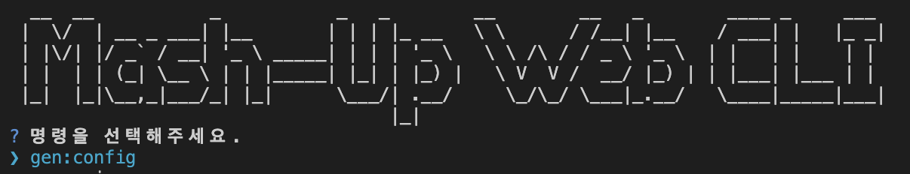

# Auto Configuration

## 1. 패키지 설치

import Tabs from '@theme/Tabs';
import TabItem from '@theme/TabItem';

<Tabs groupId="package-managers">
  <TabItem value="pnpm1" label="pnpm" default>

```bash
pnpm install @mash-up-web-toolkit/command
```

  </TabItem>
  <TabItem value="npm1" label="npm">

```bash
npm install @mash-up-web-toolkit/command
```

  </TabItem>
  <TabItem value="yarn1" label="yarn">

```bash
yarn add @mash-up-web-toolkit/command
```

  </TabItem>
</Tabs>

## 2. 실행

<Tabs groupId="package-managers">
  <TabItem value="pnpm2" label="pnpm" default>

```bash
pnpm mash-up-web
```

  </TabItem>
  <TabItem value="npm2" label="npm">

```bash
npx mash-up-web
```

  </TabItem>
  <TabItem value="yarn2" label="yarn">

**방법 1: npx 사용 (권장)**

```bash
npx mash-up-web
```

**방법 2: package.json 스크립트 추가**

```json
{
  "scripts": {
    ...
    "mash-up-web": "node .node_modules/.bin/mash-up-web"
  }
    ...
}

yarn mash-up-web
```

  </TabItem>
</Tabs>



gen:config 를 선택하세요. 설정파일 생성됩니다.

⚠️ 이미 존재할 경우 생성되지 않습니다.

```ts
import type { MashupConfig } from '@mash-up-web-toolkit/command';

const config: MashupConfig = {
  'gen:api': {
    /**
     * @description 생성될 파일의 경로
     */
    output: '',

    /**
     * @description 생성할 API의 주소
     */
    url: '',

    /**
     * @description fetch 또는 axios 인스턴스 경로
     */
    instancePath: '',

    /**
     * @description httpClient 덮어쓰기 여부 (true: 덮어쓰기, false: 기존 파일 사용)
     */
    httpClientRewrite: false,
  },
};

export default config;
```
